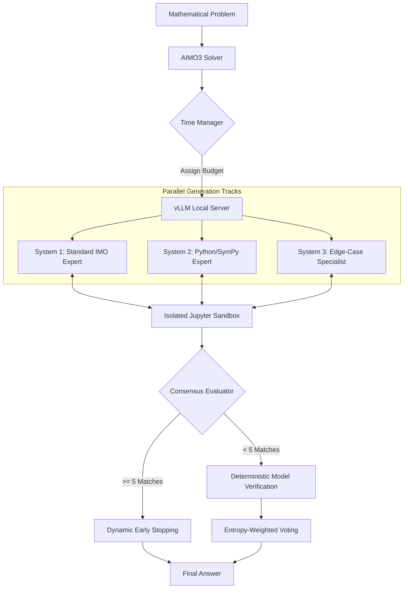

# 🏆 AIMO 3 - 39 Pts Solution (Top 2357)

This repository contains the official 39-point solution for the **AI Mathematical Olympiad - Progress Prize 3 (AIMO 3)**. The system implements a sophisticated mathematical agentic workflow leveraging a **120B parameter LLM** executed entirely offline via **vLLM**, integrated with an isolated **Jupyter Python Sandbox** for verification and an **entropy-weighted voting system**.

**Kaggle Notebook:** [AIMO 3 Solve](https://www.kaggle.com/code/dlthhb/aimo-3-solve)

## 🧠 System Architecture

The inference pipeline is designed to maximize mathematical certainty within a computationally constrained environment (9-hour Kaggle limit). It balances deep reasoning turns with aggressive time management.

## 🛠️ Class & Module Breakdown

### 1. `CFG` (Configuration)
The central nervous system of the project. It defines critical hardware utilization parameters and inference limits:
* **`gpu_memory_utilization = 0.96`**: Pushing the limits of the dual T4 or P100 environment.
* **`kv_cache_dtype = 'fp8_e4m3'`**: Reducing VRAM footprint to allow longer context windows and faster batching.
* **`notebook_limit = 17400`**: Hard stop for global time management to ensure the last submission is processed.

### 2. `AIMO3Sandbox`
Encapsulates a `KernelManager` to handle stateful Python execution. 
* **State Persistence**: Variables and libraries (`itertools`, `mpmath`, `sympy`) persist between LLM calls, allowing iterative debugging.
* **Timeout Control**: Uses `interrupt_kernel()` to prevent the model from entering infinite loops or heavy computations.

### 3. `AIMO3Tool`
The bridge between the LLM and the code environment. It reformats LLM outputs into executable Python scripts, ensuring results are always wrapped in `print()` statements for the LLM to "see" the numerical output.

### 4. `AIMO3Solver` (The Orchestrator)
This class manages the lifecycle of the entire solving attempt:
* **Server Management**: Handles `subprocess.Popen` for the vLLM API server.
* **Preloading Weights**: Implements a `ThreadPoolExecutor` to read model files into the OS Page Cache before server start, drastically reducing initialization latency.
* **Dynamic Budgeting**: Calculates the remaining time per problem based on `problems_remaining`, preventing time-outs in late-stage problems.

## 🔬 Mathematical Decision Logic

The solution does not rely on simple majority voting. Instead, it employs a multi-phase verification protocol:

| Phase | Strategy | Criteria |
| :--- | :--- | :--- |
| **Phase 1** | **Unanimous Consensus** | If >= 4 independent agents agree on an answer, it is immediately accepted. |
| **Phase 2** | **Model Verification** | Candidates with >= 2 votes are sent back to the model for a deterministic "CORRECT/WRONG" sanity check at `temperature=0.0`. |
| **Phase 3** | **Entropy Fallback** | The answer with the highest confidence weight is selected using the generated log-probabilities. |

### Entropy-Weighted Selection
For every generated answer $a$, we compute the mean Shannon entropy $S$ of its token distribution:

$$S = -\frac{1}{N} \sum_{i=1}^{N} \sum_{j} p_{i,j} \log_2(p_{i,j})$$

Where $p_{i,j}$ are the top-5 logprobs for each token. We then apply a weight:

$$W = \frac{1}{\max(S, 10^{-9})}$$

The final selection is the answer that maximizes the sum of its weights across all attempts, favoring "confident" generations over "uncertain" ones.

## 🚀 Key Features

* **vLLM Integration**: Continuous batching and prefix caching for high-throughput inference.
* **Harmony Encoding**: High-fidelity parsing of OpenAI-style tool calls using the `openai_harmony` library.
* **Dynamic Early Stopping**: Saves up to 40% of compute time when a clear consensus is reached early.
* **Deterministic Verification**: A final zero-temperature pass to double-check the logic of the most likely candidate.
